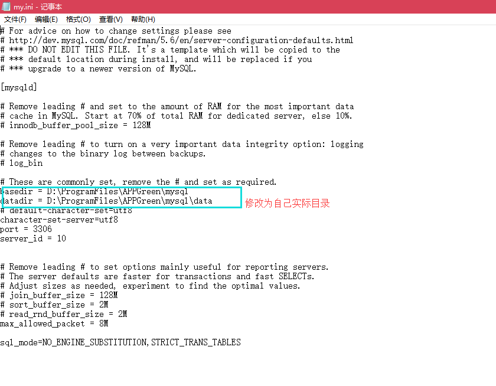
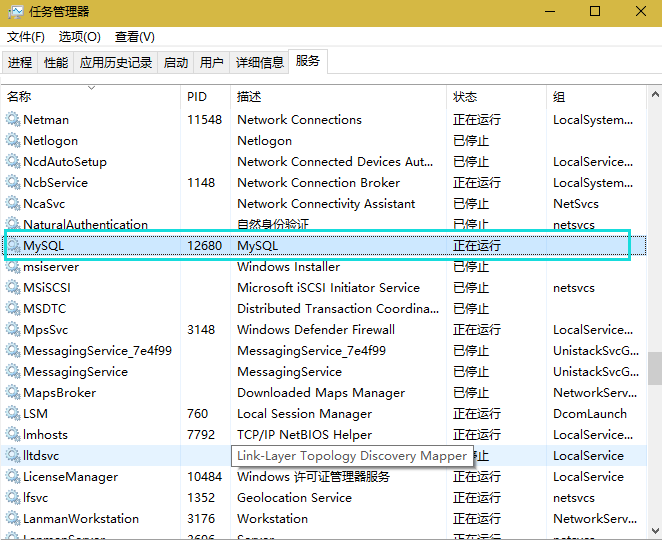

# MySQL绿色版免安装教程

 

### 1、配置环境变量


 

### 2、服务配置

#### 2.1、修改配置

打开解压文件目录，找到后缀名为.ini的文件，复制一份更名为my.ini

修改配置：



 

 

#### 2.2、安装服务

 

my.ini文件配置好后就可以在cmd中安装mysqld服务了，在cmd中运行命令

命令：

```
mysqld --install MySQL   --defaults-file="D:\Program Files(x86)\MySql\my.ini"   
```


其中的MySQL是安装服务器的名称，可以指定任何名称。安装完成后会提示下面的信息：Service successfully installed，即表示安装成功。

 

#### 2.3、查看服务

 



 

 

 

 

 

 

# 附件

 

1、配置文件my.ini

~~~powershell

[mysqld]

# Remove leading # and set to the amount of RAM for the most important data
# cache in MySQL. Start at 70% of total RAM for dedicated server, else 10%.
# innodb_buffer_pool_size = 128M

# Remove leading # to turn on a very important data integrity option: logging
# changes to the binary log between backups.
# log_bin

# These are commonly set, remove the # and set as required.
basedir = D:\\ProgramFiles\\APPGreen\\mysql
datadir = D:\\ProgramFiles\\APPGreen\\mysql\\data
# default-character-set=utf8
character-set-server=utf8
port = 3306
server_id = 10


# Remove leading # to set options mainly useful for reporting servers.
# The server defaults are faster for transactions and fast SELECTs.
# Adjust sizes as needed, experiment to find the optimal values.
# join_buffer_size = 128M
# sort_buffer_size = 2M
# read_rnd_buffer_size = 2M 
max_allowed_packet = 8M

sql_mode=NO_ENGINE_SUBSTITUTION,STRICT_TRANS_TABLES 

~~~


​       [mysqld]       # Remove leading # and set to the amount   of RAM for the most important data   # cache in MySQL. Start at 70% of total   RAM for dedicated server, else 10%.   # innodb_buffer_pool_size = 128M       # Remove leading # to turn on a very   important data integrity option: logging   # changes to the binary log between   backups.   # log_bin       # These are commonly set, remove the #   and set as required.   basedir = D:\ProgramFiles\APPGreen\mysql   datadir =   D:\ProgramFiles\APPGreen\mysql\data   # default-character-set=utf8   character-set-server=utf8   port = 3306   server_id = 10           # Remove leading # to set options mainly   useful for reporting servers.   # The server defaults are faster for   transactions and fast SELECTs.   # Adjust sizes as needed, experiment to   find the optimal values.   # join_buffer_size = 128M   # sort_buffer_size = 2M   # read_rnd_buffer_size = 2M    max_allowed_packet = 8M       sql_mode=NO_ENGINE_SUBSTITUTION,STRICT_TRANS_TABLES      