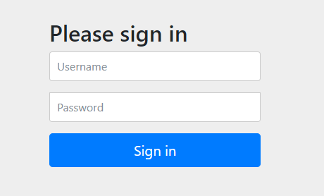

# Spring boot security

Springboot 对接 security

[TOC]

## 1、security 初步了解

### 1.1、添加配置

spring boot项目中添加maven依赖 

pom.xml

~~~xml
<!-- springboot web  -->
<dependency>
    <groupId>org.springframework.boot</groupId>
    <artifactId>spring-boot-starter-web</artifactId>
</dependency>

<!-- springboot security -->
<dependency>
    <groupId>org.springframework.boot</groupId>
    <artifactId>spring-boot-starter-security</artifactId>
</dependency>
~~~

### 1.2、编写测试请求

~~~java
/**
 * @description
 *	测试控制器
 * @author TianwYam
 * @date 2021年4月17日下午1:49:05
 */
@RequestMapping("/test")
@RestController
public class TestController {
	
	@GetMapping({"","/"})
	public String test() {
		return "test" ;
	}
}
~~~

### 1.3、启动项目

~~~java
/**
 * @description
 *	springboot 主启动类
 * @author TianwYam
 * @date 2021年4月17日下午1:45:15
 */
@SpringBootApplication
public class SecurityApplication {
	
	public static void main(String[] args) {
		SpringApplication.run(SecurityApplication.class, args);
	}

}
~~~

启动项目后，访问请求：

~~~
http://localhost:8080/test
~~~

### 1.4、界面

界面就会拦截所有请求，并且进入默认的spring boot security登录界面

重定向到：

~~~
http://localhost:8080/login
~~~

默认用户名：user

默认密码：在项目启动后，控制台有输出，类似：

~~~java
// 781ac895-b3e6-4985-adda-32b97621665e 就是密码
Using generated security password: 781ac895-b3e6-4985-adda-32b97621665e
~~~

登录成功后即可访问

## 2、自定义用户名密码

在 application.yml主配置文件中，配置

~~~yaml
# spring security 自定义用户名密码
spring:
  security:
    user:
      name: admin
      password: admin
~~~

访问实际业务请求时，重定向到spring boot security默认登录界面

输入用户名 admin 密码 admin登录

登录成功后，才可放行

这种方式，只适合配置单个用户，并且用户配置固定，若是需要配置多个用户，则可以自定义配置security

