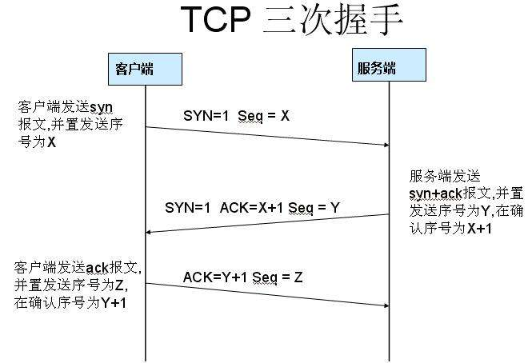
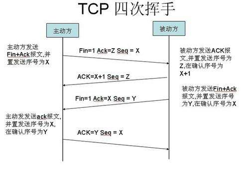

# 计算机基础

## 操作系统

### 进程

**进程**是一个具有一定独立功能的程序在一个数据集上的一次动态执行的过程，是**操作系统进行资源分配和调度的一个独立单位**，是应用程序运行的载体。

系统中一个**进程**一般是由 **程序** 、 **数据集合** 和 **进程控制块**（PCB） 三部分组成。

​	**程序**用于描述进程要完成的功能，是控制进程执行的指令集；

​	**数据集合**是程序在执行时所需要的数据和工作区；

​	**程序控制块**包含进程的描述信息和控制信息，是进程存在的唯一标志。

进程的四大特点: 并发、共享、虚拟、异步。

**进程**具有的**特征**：

- 动态性：进程是程序的一次执行过程，是临时的，有生命期的，是动态产生，动态消亡的；
- 并发性：任何进程都可以同其他进行一起并发执行；
- 独立性：进程是系统进行资源分配和调度的一个独立单位；
- 结构性：进程由程序，数据和进程控制块三部分组成

### 进程间通信(IPC)

**进程间通信**是指在不同进程之间传播或交换信息，在Linux环境下，进程地址空间相互独立，每个进程各自有不同的用户地址空间，进程之间不能相互访问。必须通过内核才能进行数据交换。

进程间主要有8种通信方式：

1. **无名管道( pipe )**：管道是一种半双工的通信方式，数据只能单向流动，而且只能在具有亲缘关系的进程间使用。进程的亲缘关系通常是指父子进程关系。
2. **高级管道(popen)**：将另一个程序当做一个新的进程在当前程序进程中启动，则它算是当前程序的子进程，这种方式我们成为高级管道方式。
3. **有名管道FIFO (named pipe)** ： 有名管道也是半双工的通信方式，但是它允许无亲缘关系进程间的通信。
4. **消息队列( message queue )** ： 消息队列是由消息的链表，存放在内核中并由消息队列标识符标识。消息队列克服了信号传递信息少、管道只能承载无格式字节流以及缓冲区大小受限等缺点。
5. **信号量(semophore )** ： 信号量是一个计数器，可以用来控制多个进程对共享资源的访问。它常作为一种锁机制，防止某进程正在访问共享资源时，其他进程也访问该资源。因此，主要作为进程间以及同一进程内不同线程之间的同步手段。
6. **信号 (Signal)** ： 信号是一种比较复杂的通信方式，用于通知接收进程某个事件已经发生。
7. **共享内存(shared memory )** ：共享内存就是映射一段能被其他进程所访问的内存，这段共享内存由一个进程创建，但多个进程都可以访问。共享内存是最快的 IPC 方式，它是针对其他进程间通信方式运行效率低而专门设计的。它往往与其他通信机制，如信号量配合使用，来实现进程间的同步和通信。
8. **套接字(socket )** ： 套接字也是一种进程间通信机制，与其他通信机制不同的是，它可用于不同机器间的进程通信。

### 进程调度

进程调度便是实现并发的关键一环。

在操作系统中存在多种调度算法，其中有的调度算法适用于作业调度，有的调度算法适用于进程调度，有的调度算法两者都适用。

常用几种调度算法：

**1.先来先服务(FCFS)**

一种简单的调度算法,适用于作业和进程调度。

先来先服务算法**按照进程/作业到达先后顺序**来进行调度。

当作业调度采用该算法时,每次调度都会从后备队列中取出最先到达的作业,为他分配内存,创建PCB,放入就绪队列中;当进程调度采用该算法时,每次调度都会从就绪队列中取出最先进入该队列的进程,给他分配处理机(处理机=CPU+主存储器+IO设备)。

**2.短作业优先(SJF)**

作业或进程的长短是以作业或进程要求**运行时间的长短来衡量的。**

**3.优先级调度**

作业或进程的**优先级来确定优先调度权。**

　　**(1)静态优先级 --- 优先级在进程/作业调度前就确定并不会更改。**

　　**(2)动态优先级 --- 优先级会随进程的执行情况而改变,更灵活,科学。**

**4.时间片轮转法(RR)**

主要用于分时系统的进程调度。
**进程/作业放在一个队列上**，CPU拿出第一个进程运行一个时间片后,将其放在队尾,轮询执行。

批处理系统常用调度算法：
①、先来先服务FCFS
②、最短作业优先
③、最短剩余时间优先
④、响应比最高者优先

分时系统调度算法：
①、轮转调度
②、优先级调度
③、多级队列调度
④、彩票调度

实时系统调度算法：
①、单比率调度
②、限期调度
③、最少裕度法

### 进程优先级

进程可划分为普通进程和实时进程

优先级值越小表示进程优先级越高

静态优先级： 不会时间而改变，内核也不会修改，只能通过系统调用修改

实时优先级：只对实时进程有意义

动态优先级： 调度程序通过增加或减少进程静态优先级的值，来达到奖励IO消耗型或惩罚cpu消耗型的进程，调整后的进程称为动态优先级

### 虚拟文件系统

**虚拟文件系统**(VFS)是由Sun microsystems公司在定义**网络文件系统**(NFS)时创造的。

它是一种用于网络环境的**分布式文件系统**，是允许和操作系统使用不同的文件系统实现的接口。

**虚拟文件系统**(VFS)是物理文件系统与服务之间的一个接口层，它对Linux的每个文件系统的所有细节进行抽象，使得不同的文件系统在linux系统。

它只存在于内存中，不存在于任何外存空间。VFS在系统启动时建立，在系统关闭时消亡。

严格说来，VFS并不是一种实际的文件系统。它只存在于内存中，不存在于任何外存空间。
VFS在系统启动时建立，在系统关闭时消亡。

## 多线程

## 计算机网络

### OSI七层模型

OSI为（Open System interconnect）的缩写。

OSI七层模型从下到上：

物理层、数据链路层、网络层、传输层、会话层、表示层、应用层

#### 物理层

作用：定义一些电器，机械，过程和规范

如：网卡，网线，集线器，中继器，调制解调器

#### 数据链路层

作用：定义如何格式化数据，支持错误检测

典型协议：以太网，帧中继（老式级别VPN）

如：网桥，交换机

#### 网络层

作用：定义一个逻辑的寻址，选择最佳路径传输，路由数据包

典型协议：IP，IPX，ICMP，ARP(IP->MAC)，IARP

如：路由器

#### 传输层

作用：提供可靠和尽力而为的传输，负责网络传输和会话建立

典型协议：TCP，UDP，SPX，EIGRP，OSPF

#### 会话层

作用：控制会话，建立、管理、终止应用程序会话

典型协议：NFS, SQL, ASP, PHP, JSP, RSVP(资源源预留协议), windows

#### 表示层

作用：格式化数据

典型协议：ASCII, JPEG. PNG, MP3. WAV, AVI

#### 应用层

作用：控制应用程序，为应用程序提供网络服务

典型协议：telnet, ssh, http, ftp, smtp, rip, BGP

### **TCP三次握手**

TCP连接过程的三次握手状态转移

### **TCP四次挥手**

TCP断开连接的四次挥手过程中的状态转移

### **TCP和UDP的区别**

| TCP/UDP      |                             TCP                              |                             UDP                              |
| :----------- | :----------------------------------------------------------: | :----------------------------------------------------------: |
| 连接方面     |           TCP面向连接（如打电话要先拨号建立连接）            |         UDP是无连接的，即发送数据之前不需要建立连接          |
| 安全方面     | TCP提供可靠的服务，通过TCP连接传送的数据，无差错，不丢失，不重复，且按序到达 |             UDP尽最大努力交付，即不保证可靠交付              |
| 传输效率     | TCP传输效率相对较低，TCP拥有握手、确认、窗口、重传、拥塞控制等机制 | UDP传输效率高，适用于对高速传输和实时性有较高的通信或广播通信 |
| 连接对象数量 |                TCP连接只能是点到点、一对一的                 |       UDP支持一对一，一对多，多对一和多对多的交互通信        |
| 应用场合     |                           少量数据                           |                         传输大量数据                         |

### **TCP拥塞控制**

**拥塞控制**就是防止过多的数据注入到网络中，这样可以使网络中的路由器或链路不致过载。

**拥塞控制的四种算法**：

- 慢开始（Slow-start)
- 拥塞避免（Congestion Avoidance)
- 快重传（Fast Restrangsmit)
- 快回复（Fast Recovery）

### **DNS**

**DNS**( Domain Name System)是**域名系统**的英文缩写，是一种组织成域层次结构的计算机和网络服务命名系统，它用于TCP/IP网络，它所提供的服务是用来将主机名和域名转换为IP地址的工作。

DNS就是用来在IP与域名之间进行转换的服务。

## 数据结构

## 算法

# java语言基础

